**Vehicle Detection Project**

The goals / steps of this project are the following:

* Perform a Histogram of Oriented Gradients (HOG) feature extraction on a labeled training set of images and train a classifier Linear SVM classifier
* Optionally, you can also apply a color transform and append binned color features, as well as histograms of color, to your HOG feature vector. 
* Note: for those first two steps don't forget to normalize your features and randomize a selection for training and testing.
* Implement a sliding-window technique and use your trained classifier to search for vehicles in images.
* Run your pipeline on a video stream (start with the test_video.mp4 and later implement on full project_video.mp4) and create a heat map of recurring detections frame by frame to reject outliers and follow detected vehicles.
* Estimate a bounding box for vehicles detected.

###Histogram of Oriented Gradients (HOG)

####1. Explain how (and identify where in your code) you extracted HOG features from the training images.

The code for this step is in the second section in the cell number 6. In cell number 7 there is an example of the use and the ouput image, also attached here:  

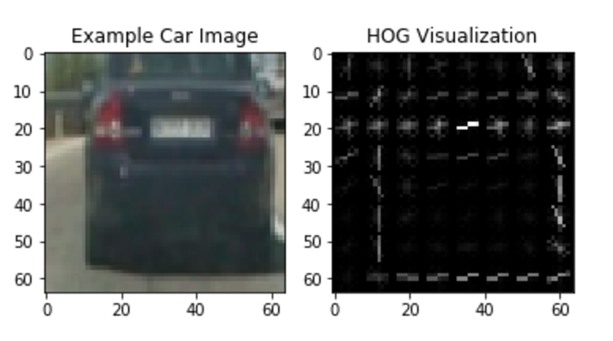

In the final solution I will use `YCrCb` as color space, and use all the channels to get the HOG features.

The data for the `vehicle` and `non_vehicle` images have been downloaded from the lesson data. In the utils section there is a function who reads both type of images and return two arrays with the two groups. 

The method `get_hot_features` can have two possible outputs, depending on the input argument `vis`, that basically indicates if we can also get an output image for the HOG visualization. We will pass `true` just for the test and keep the value to `false` in other case.
During the realization of the project I used different values for `orientations`, `pixels_per_cell` and `cells_per_block`, and finally choose `9`, `8` and `2` respectively. 
Biggest difference in time I saw when I was increasing or decreasing the `orientations` value. Increase the value to 12, made my whole pipeline slower, and there was not a big difference in the result of the classifier. So finally I decided to leave it like it was.

####2. Explain how you settled on your final choice of HOG parameters.

The only way I had to check how the HOG parameters affect my choice was testing in my classifier. 
As mentioned before, I read the image data and used to get the HOG features for `vehicles` and `non_vehicles` images.
After several tweaking and testing different options, I got the best results with the following values:

`color space` -> YCrCb
`orientations` -> 9
`pixels_per_cell` -> 8
`cells_per_block` -> 2
`hog_channel` -> ALL

Increasing the orientation, using all the channels from the image to get the features, together with smaller blocks and less pixels for cell, made the process of getting the vector features considerably slow in my laptop, but got the best prediction with this values (over 98%).

####3. Describe how (and identify where in your code) you trained a classifier using your selected HOG features (and color features if you used them).

In the cell number 8 starts all the cells I used to create and train my classifier. In the first you can see the values were mentioned in previous point. All my test to get the best performance in the classifier has been changing the values in this cell.

In the cell 9 is defined the function `extract_features`. This function, given an array of images will get spatial, histogram and HOG features and return them as a list of feature vectors. Here I tried to use all the features that we studied in the lesson to try to get the best result in my classifier.

In cell 10 we load the images for `vehicles` and `non_vehicles` and call the `extract_features` to get the features vector. An important point here is that both arrays were balanced, so there was not a big difference between the amount of images. So I have more or less the same number of positive and negative examples, and this way I avoid that the algorith will classify everything belonging to the majority class.

In the next cell, we preprocess the data by applying `StandardScaler`. We create the labels vectors and randomly split the data between `train` and `test`. We will use 80% for training and 20% for testing. This will help to avoid overfitting and improve generalization.

In the last cell I created an SVC classifier, training with the train data we created in previous cell and later, use it to predict in a small subset (10 examples) of the test data. 

###Sliding Window Search

####1. Describe how (and identify where in your code) you implemented a sliding window search.  How did you decide what scales to search and how much to overlap windows?

Following the same approach than in the lesson. I started with a basic sliding window search, and then moved to the more efficient way with Hog Sub-sampling Window Search. With cells of 8 by 8 pixels and step per cell of 2 pixels I got the maximun number of boxes detected. What it is translated in a 75% of overlap windows. When incrementing the step per cell to 4 pixels, which means 50% of overlap, the amount of positives decreased in a big amount. Here is an example of the same two image with 75% overlap and with 50%:

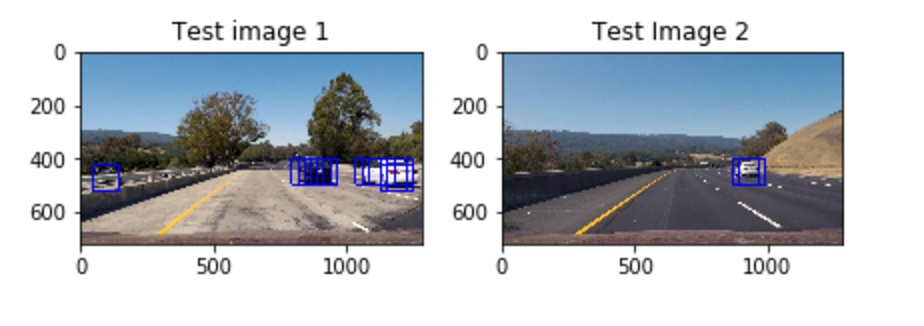
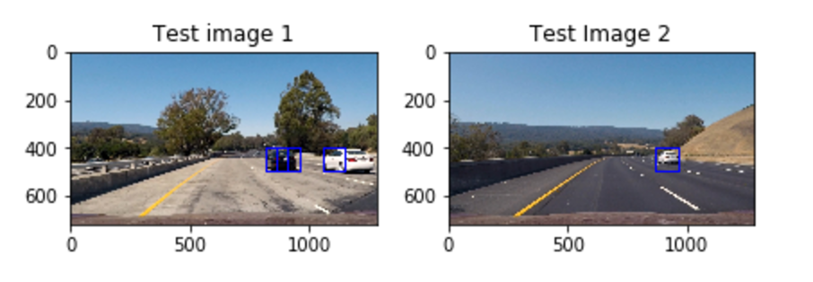

Also I restrict the search to a certain y-values of the image, since most of the upper part of the image is not interesting for vehicle detection. 

####2. Show some examples of test images to demonstrate how your pipeline is working.  What did you do to optimize the performance of your classifier?

Ultimately I searched on two scales using YCrCb 3-channel HOG features plus spatially binned color and histograms of color in the feature vector, which provided a nice result.  Here are some example images:

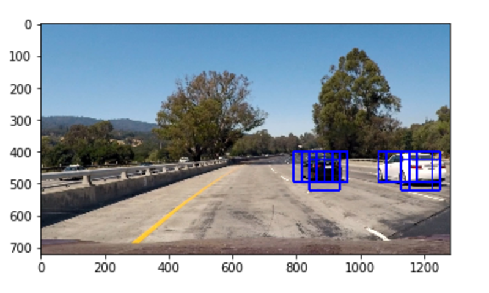
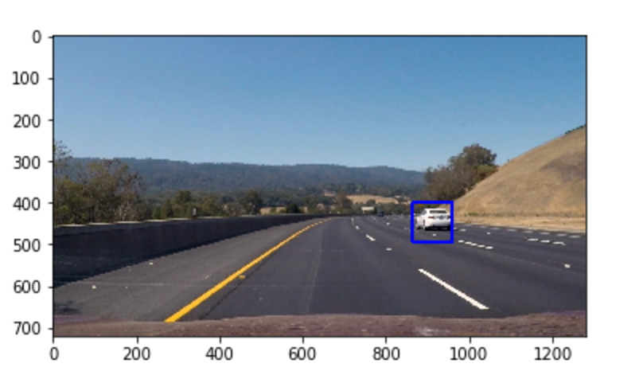
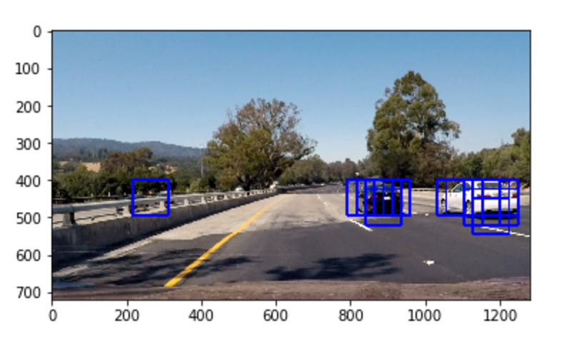
---

### Video Implementation

####1. Provide a link to your final video output.  Your pipeline should perform reasonably well on the entire project video (somewhat wobbly or unstable bounding boxes are ok as long as you are identifying the vehicles most of the time with minimal false positives.)
Here's a [link to my video result](./output.mp4)

####2. Describe how (and identify where in your code) you implemented some kind of filter for false positives and some method for combining overlapping bounding boxes.

For each frame in the video we get the windoes for every positive detected. First thing we do is create a heatmap for the image with all the positives, and apply a threshold (in my case is 1) to filter the false positives. After that I used `scipy.ndimage.measurements.label()` to identify individual blobs in the heatmap. Assuming that each blob correspond with a vehicle, I construct the bounding boxes to cover the area of each blob.

Here's an example result showing the heatmap from a series of frames of video, the result of `scipy.ndimage.measurements.label()` and the bounding boxes then overlaid on the last frame of video:

### Here are six frames and their corresponding heatmaps:

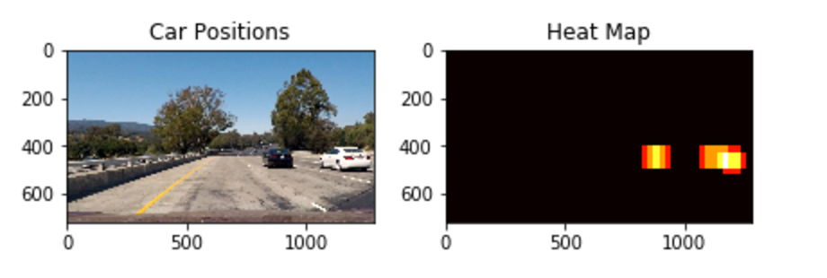
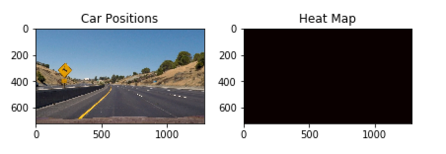
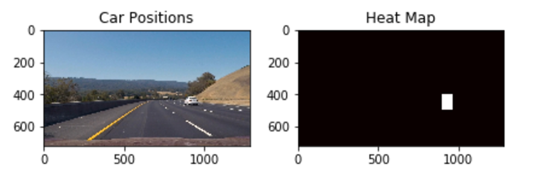
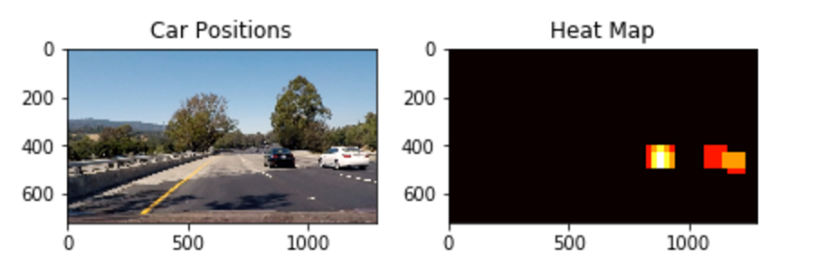
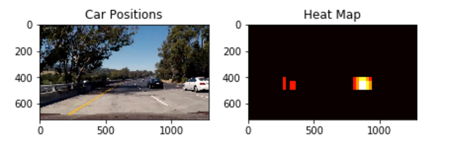
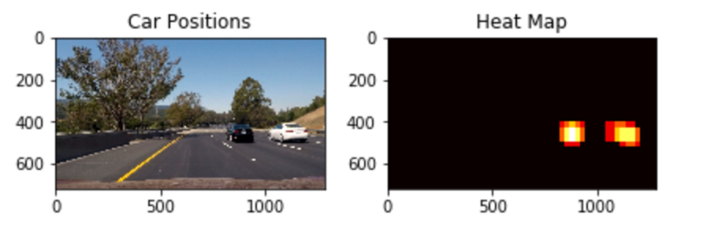

### Here is the output of `scipy.ndimage.measurements.label()` on the integrated heatmap from all six frames:

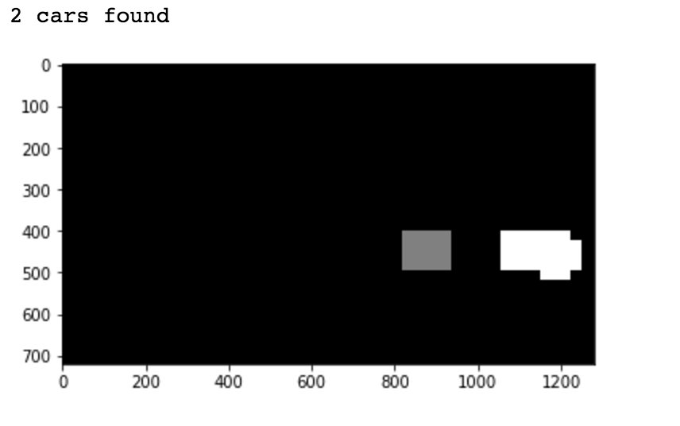
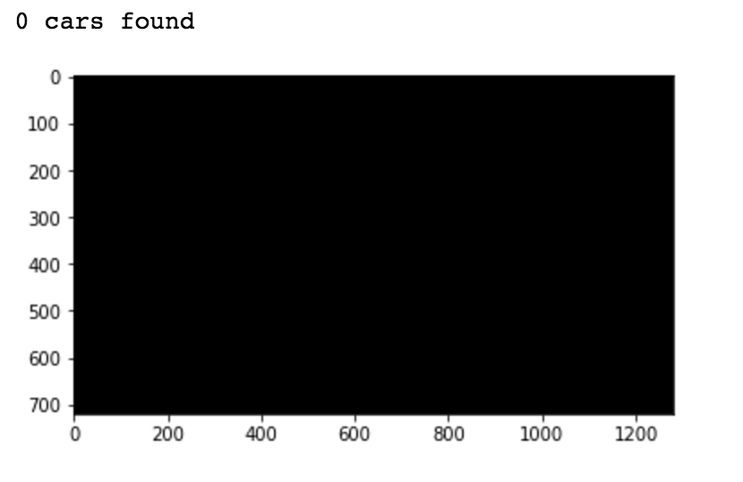
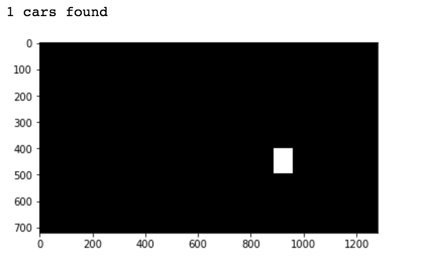
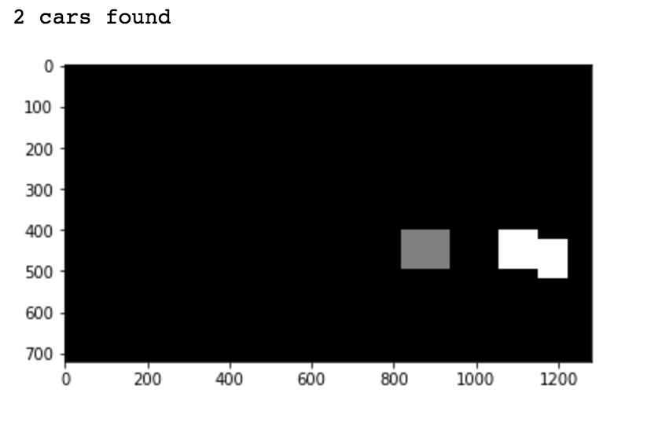
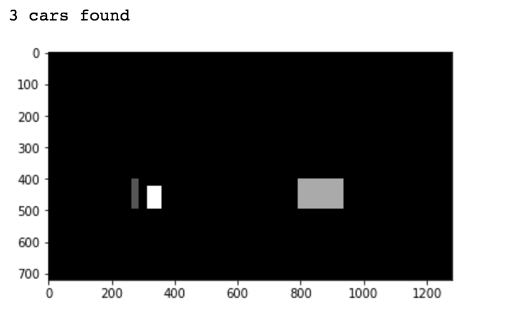
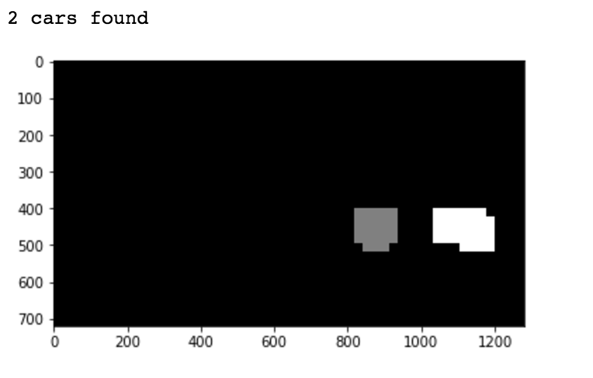

### Here the resulting bounding boxes are drawn onto the last frame in the series:

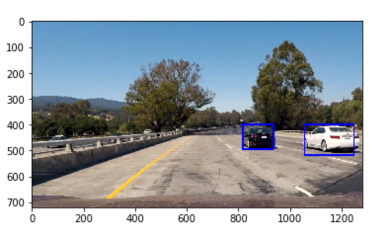
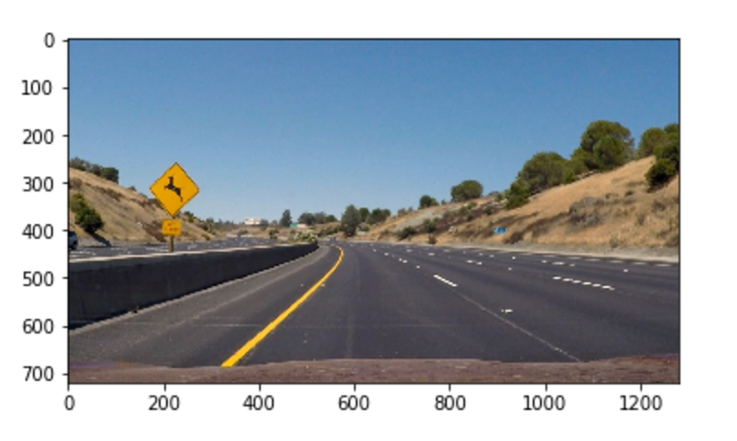
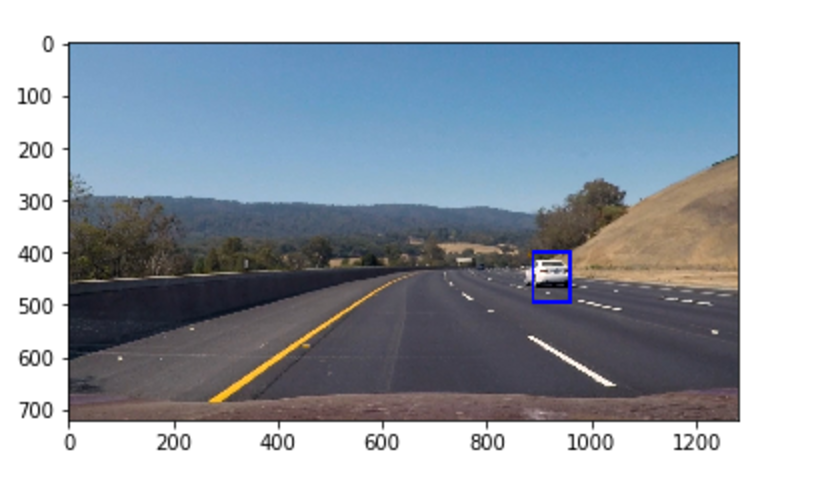
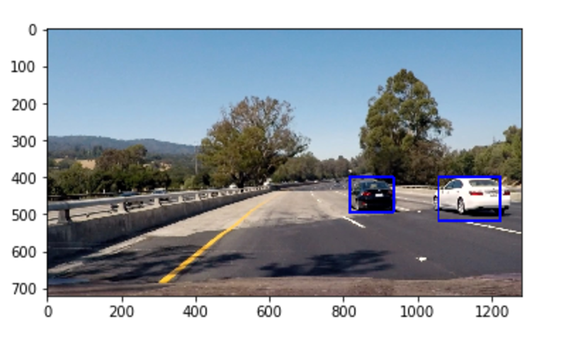
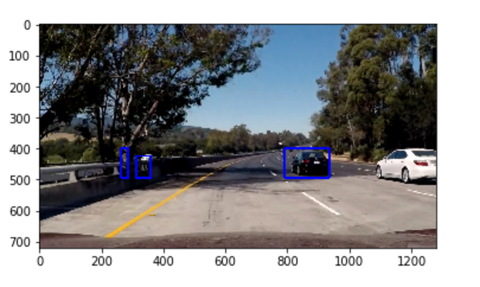
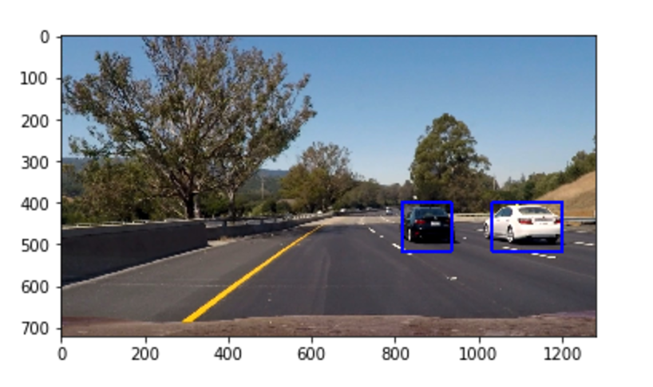

---

###Discussion

####1. Briefly discuss any problems / issues you faced in your implementation of this project.  Where will your pipeline likely fail?  What could you do to make it more robust?

Here I'll talk about the approach I took, what techniques I used, what worked and why, where the pipeline might fail and how I might improve it if I were going to pursue this project further.  

